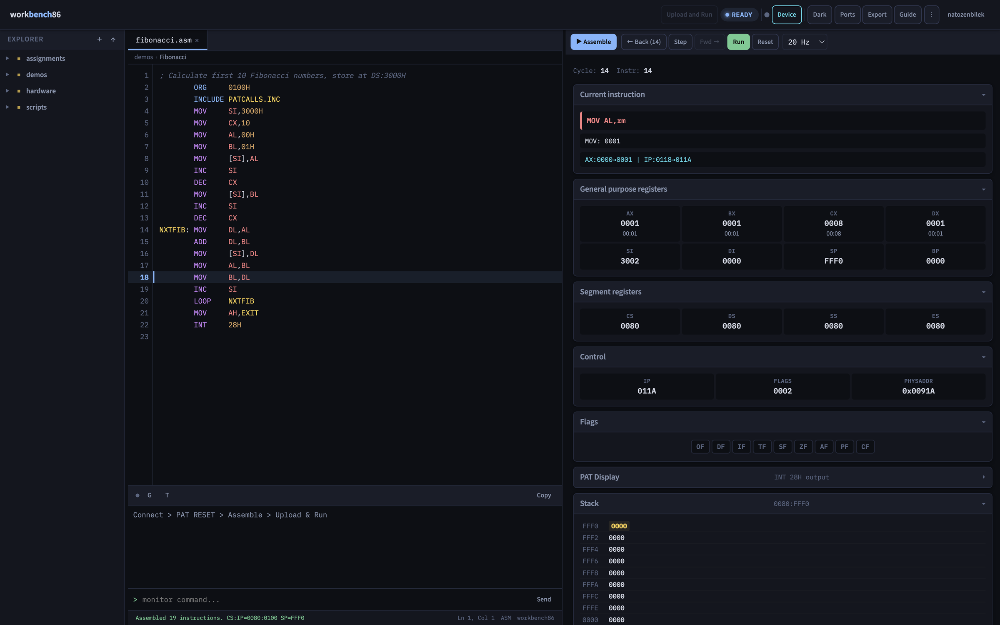
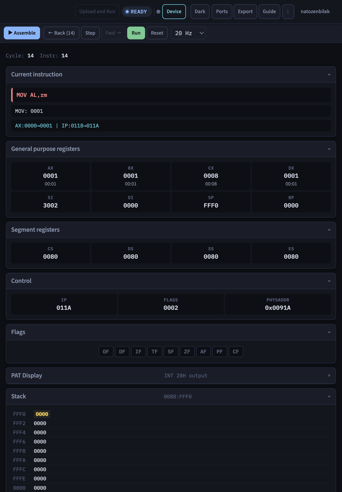
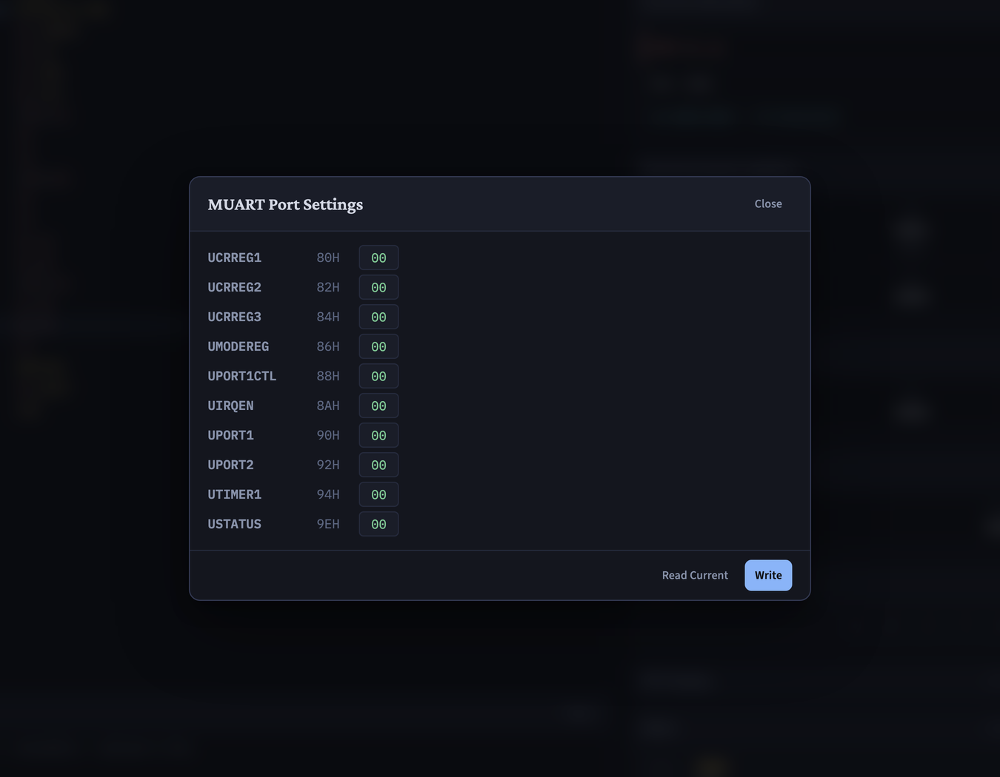

# workbench86

English: [README.md](README.md)

workbench86, DIGIAC 2000 laboratuvar eğitim setinin tarayıcıdaki tezgâhı. 8086 real mode assembly yazarsınız, ileri olduğu kadar geriye de adımlayabilen bir debugger ile simüle edersiniz, eğitim setinin I/O portlarının nasıl tepki verdiğini izlersiniz ve assemble edilmiş byte'ları WebSerial üzerinden fiziksel karta yüklersiniz.

Canlı demo: <https://natozenbilek.github.io/workbench86/>



## Neden var

Hedef donanım, LJ Technical Systems'in DIGIAC 2000 Microprocessor Training System eğitim seti, daha doğrusu onun 80286 CPU kartı. Laboratuvarda bu karta "PAT" deniyor. Bu, Hacettepe Üniversitesi'nde kullanılan yerel bir isim, üreticinin verdiği bir ürün adı değil. Kart, Hacettepe Üniversitesi Bilgisayar Mühendisliği'nde BBM436 Mikroişlemciler Laboratuvarı dersinde ve İstanbul Teknik Üniversitesi'nde kullanılıyor.

Set modüler. Bir kasa; CPU kartını ve keypad ve display modülünü taşıyor. Applications Module ise peripheral'ları taşıyor: LED'ler, optical disc encoder'ı olan bir DC motor, bir potansiyometre, ADC ve DAC, ultrasonic transmitter ve receiver, optical link ve piezo buzzer.

Bu karta program yazmanın yolu, kartla birlikte gelen komut satırı assembler'ı Merlin. Programı yazar, assemble eder, byte'ları kartın ROM monitor'üne yüklersiniz; `PATCALLS.INC` ve INT 28H çağrı kümesi de oradan gelir. Merlin'in vermediği şey makinenin görüntüsü: program çalışırken register veya bellek göstergesi yok, bir şeyi kaçırdığınızda bir komut geri gitmenin yolu yok, ve önünüzde fiziksel bir kart olmadan hiçbir şeyi denemenin yolu yok. Pratikte bu, lab saatini beklemek demek.

workbench86, aynı iş akışını değiştirmeden etrafına tam bir IDE koyuyor. Kartın yerini almıyor, Merlin'in kurallarının da yerini almıyor: `INCLUDE PATCALLS.INC` ile yazılmış bir program burada da değişmeden assemble oluyor, yani mevcut ders materyali çalışmaya devam ediyor. Simülatörün çalıştırdığı byte dizisi ile yüklemenin gönderdiği aynı; yani simülatör, program donanıma gitmeden önce onu doğru hale getirdiğiniz yer.

workbench86 tek sayfalık bir uygulama. Build adımı, backend ve çalışma zamanı bağımlılığı yok. 32 dosyada yaklaşık 5.8 kLOC JavaScript ve 7 dosyada 1.6 kLOC CSS, hepsi vanilla. Herhangi bir statik sunucudan çalışır, büyük kısmı `file://` üzerinden de çalışır.

## Hızlı başlangıç

Depoyu klonlayın ve `index.html` dosyasını açın:

```bash
git clone https://github.com/natozenbilek/workbench86.git
cd workbench86
open index.html        # macOS
xdg-open index.html    # Linux
start index.html       # Windows
```

Editör, assembler, simülatör ve debugger bu şekilde çalışır. İki şey çalışmaz. Örnek programlar `fetch` ile yükleniyor, tarayıcı bunu `file://` üzerinden engelliyor; WebSerial ise secure context istiyor. İkisi için dizini HTTP üzerinden sunun:

```bash
python3 -m http.server 8000
```

Sonra <http://localhost:8000> adresini açın.

İlk programınız:

1. Explorer'da `demos` klasörünü açın ve `fibonacci.asm` dosyasına tıklayın.
2. Assemble edip yüklemek için `Ctrl+Enter` tuşlarına basın.
3. Tek komut çalıştırmak için `Step` düğmesine basın. Debug panelinin tepesindeki Current instruction kartı, mnemonic'i ve değişen register'ları gösterir.
4. `Run` ile 20 Hz'de çalıştırın ve dizinin register'larda oluşmasını izleyin.
5. Geri adımlamak için sol ok düğmesine basın. Register'lar, bellek, portlar ve peripheral durumu hep birlikte geri sarılır.

## Özellikler

### Editör

Çok sekmeli; açık dosya sekme başına takip edilir. Assembly için ve transpiler'ın okuduğu beş dil için syntax highlighting var. Bir mnemonic'in veya register'ın üzerine gelince ne yaptığını gösteren bir ipucu çıkar. Find ve replace `Ctrl+F` ile açılır ve düzenli ifadeleri kabul eder. `Ctrl+Shift+P` ile açılan command palette her eylemi ismiyle bulur. Ghost completion imlecin olduğu yerde bir label veya directive önerir, `Tab` öneriyi kabul eder. Undo stack'i editörün kendisine ait, tarayıcınınkine değil.

### Debug paneli



Sağdaki panel, katlanabilir kartlardan oluşan bir sütun.

| Kart | İçerik |
|---|---|
| Current instruction | Mnemonic, etkinin sade bir anlatımı ve son adımın register farkı |
| General purpose registers | AX'ten DI'ya, high ve low byte'lar ve ASCII karşılıkları |
| Segment registers | CS, DS, SS, ES |
| Control | IP, hex olarak FLAGS ve 20 bitlik fiziksel adres |
| Flags | OF, DF, IF, TF, SF, ZF, AF, PF, CF |
| PAT Display | INT 28H çıktısı, 7 segment display olarak çizilir |
| Stack | SS:SP çevresindeki word'ler, güncel SP işaretli |
| Memory | Yazdığınız adreste veya CS:IP ya da SS:SP'yi takip ederek hex ve ASCII görünüm |
| Execution Trace | Son çalışan komutlar ve register farkları |
| Watch | `AX`, `DS:1000`, `[SI]` veya bir label gibi ifadeler |
| I/O Log | Son IN ve OUT işlemleri, üstünde bir zaman şeridi ile |

### Run controls

Assemble, `Ctrl+Enter` ya da düğme. Step, step back ve step forward tek komutluk hareketlerdir. Run ve Pause; 5, 20, 100 veya 500 Hz'de, ya da tarayıcının izin verdiği hızda serbest çalışmayı açıp kapatır. Reset başlangıç durumuna döndürür. Bir satır numarasına tıklamak breakpoint koyar.

### Dışa ve içe aktarma

Export penceresi assemble edilmiş byte'ları hex dump olarak gösterir, panoya kopyalar veya dosya olarak indirir. Aynı pencere hex dump'ı içeri de alır; Intel HEX veya sade `addr: bb bb bb` biçimi kabul edilir, böylece bir program assembler'a uğramadan simülatöre yüklenir.

## Assembler nasıl çalışıyor

Assembler, Intel mnemonic sözdizimini okur ve tek bir düz byte imajı üretir. Label'lar, hiçbir adres kaymayana kadar encoding geçişi tekrarlanarak çözülür, en fazla sekiz geçiş. Böylece bir komutu kısaltan ileri referans yanlış offset üretmek yerine oturur.

Directive'ler: `ORG`, `EQU`, `DB`, `DW`, `END` ve `INCLUDE PATCALLS.INC`. İfadeler `OFFSET`, `BYTE PTR` ve `WORD PTR` ifadelerini, konum sayacı `$` işaretini ve label'lar ile sabitler üzerinde aritmetiği kabul eder.

Adresleme modları: register, immediate, doğrudan `[disp16]`, register indirect, based, indexed ve based artı indexed. Her biri isteğe bağlı bir segment override ve isteğe bağlı bir boyut niteleyicisi alabilir.

`INCLUDE PATCALLS.INC`, port adreslerini ve INT 28H fonksiyon numaralarını sabit olarak tanımlar; böylece program `OUT 90H, AL` yerine `OUT UPORT1, AL` yazabilir. Bu dosya assembler'ın içine gömülüdür, diskten okunmaz.

## Simülatör nasıl çalışıyor

CPU modeli, 1 MB'lık bellek imajı ve tam register kümesiyle 8086 real mode. FLAGS düzgün hesaplanır; aritmetik komutlarda AF ve OF dahil. String komutları `REP`, `REPE`, `REPZ`, `REPNE` ve `REPNZ` ön ekleriyle çalışır. IF set olduğunda interrupt'lar modellenen controller'dan alınır.

Geri çalıştırma yaklaşık değil, tam. Motor her adımdan önce register'ları, port dizisini, peripheral durumunu ve interrupt durumunu bir snapshot'a alır ve bellek geri alma günlüğünü o snapshot'a devreder. Günlük, bir adresin bir önceki snapshot'tan bu yana ilk yazımdan önceki değerini tutar, adres başına tek kayıt. Yani bir adımı geri almak, o günlüğü geri oynatmak demektir. İleri adımlamak da aynı mekanizmayı ters yönde kullanır; bellek her iki yönde de byte byte geri gelir. Geçmiş 500 adım derinliğinde. Yenileri geldikçe eskiler düşer.

### Desteklenen komutlar

Uygulanmış olanlar:

- Veri taşıma: `MOV`, `XCHG`, `PUSH`, `POP`, `PUSHA`, `POPA`, `PUSHF`, `POPF`, `LEA`, `IN`, `OUT`, `XLAT`, `CBW`, `CWD`, `LAHF`, `SAHF` ve segment register'ların `PUSH` ile `POP` işlemleri.
- Aritmetik: `ADD`, `SUB`, `ADC`, `SBB`, `INC`, `DEC`, `NEG`, `CMP`, `MUL`, `IMUL`, `DIV`, `IDIV` ve BCD ile ASCII düzeltme komutları `DAA`, `DAS`, `AAA`, `AAS`, `AAM`, `AAD`.
- Mantık, shift ve rotate: `AND`, `OR`, `XOR`, `NOT`, `TEST`, `SHL`, `SAL`, `SHR`, `SAR`, `ROL`, `ROR`, `RCL`, `RCR`.
- String komutları: `MOVS`, `STOS`, `LODS`, `CMPS` ve `SCAS`, byte ve word biçimleriyle, tekrar ön ekleriyle birlikte.
- Near control flow: `JMP`, koşullu jump'lar, `JCXZ`, `LOOP`, `LOOPE`, `LOOPZ`, `LOOPNE`, `LOOPNZ`, `CALL`, `RET`, `INT`, `IRET`.
- Flag control: `CLC`, `STC`, `CMC`, `CLD`, `STD`, `CLI`, `STI`.
- Ön ekler: `CS:`, `DS:`, `ES:` ve `SS:` segment override'ları.
- Ayrıca `NOP` ve `HLT`.

Uygulanmamış olanlar:

- Far `CALL`, far `JMP` ve far `RET`.
- Protected mode.
- FPU.

## Portlar ve peripheral'lar

Intel 8256 MUART, 0x80 ile 0x9E arasındaki portlarda modellenmiştir. Kesme denetleyicisi bunun altında, 0x40 ve 0x42 adreslerinde.

| Port | Sembol | Erişim | İşlev |
|---|---|---|---|
| 0x40 | `PIC0` | W | Kesme denetleyicisi komutu. 0x20 yazmak bekleyen isteği temizler. |
| 0x42 | `PIC1` | W | Kesme denetleyicisi maskesi. |
| 0x80 | `UCRREG1` | W | Control register 1. Aynı zamanda timer saatini seçer. |
| 0x82 | `UCRREG2` | W | Control register 2. |
| 0x84 | `UCRREG3` | W | Control register 3. |
| 0x86 | `UMODEREG` | R/W | Port 2 modu. 0x00 ADC girişi, 0x03 DAC çıkışı. |
| 0x88 | `UPORT1CTL` | R/W | Port 1 yönü, hat başına bir bit. 1 o hattı çıkış yapar. |
| 0x8A | `UIRQEN` | W | IRQ izni. Bit 0 timer 1'i açar. |
| 0x8C | `UIRQADR` | R | IRQ onayı. Okumak bekleyen isteği temizler. |
| 0x90 | `UPORT1` | R/W | Port 1 verisi. Bit haritası aşağıda. |
| 0x92 | `UPORT2` | R/W | Port 2 verisi. Yazınca DAC değeri, okuyunca ADC sonucu. |
| 0x94 | `UTIMER1` | W | Timer 1 yükleme değeri. Yazmak sayımı yeniden başlatır. |
| 0x9E | `USTATUS` | R | Durum register'ı. |

`PATCALLS.INC` ayrıca 0x8E adresinde `URCVBUF` ve 0x96, 0x98, 0x9A, 0x9C adreslerinde `UTIMER2` ile `UTIMER5` arasını tanımlar. Assembler bu isimleri kabul eder ve bunlara yapılan yazma port dizisine düşer, ama modelde bunlara tepki veren bir şey yoktur.

### Port 1 bit atamaları

| Bit | İsim | Süren taraf | İşlev |
|---|---|---|---|
| 0 | `EN` | program | DAC enable, active low. Model bu bite bakmaz. DAC yolunu bunun yerine 0x86'daki mode register'ı açar. |
| 1 | `WR` | program | ADC başlatma. 1'den 0'a geçiş bir dönüşüm başlatır. |
| 2 | `BSY` | model | ADC meşgul. Dönüşüm bitince high okunur. |
| 3 | `RD` | program | ADC okuma izni, active low. Bu bit low iken port 2 dönüştürülmüş değeri verir. |
| 4 | `DSC` | model | Optik disk encoder darbesi. DAC değerinin belirlediği hızda değişir, böylece program motor turlarını sayabilir. |
| 5 | `PZO` | program | Piezo buzzer. Bu bitteki değişim sesi başlatır veya durdurur. |
| 6 | `UTX` | program | Ultrasonik verici tetiği. |
| 7 | `URX` | model | Ultrasonik alıcı. Yalnızca verici açıkken ve menzilde bir nesne varken low okunur, diğer durumlarda high. |

Okumada hangi tarafın kazanacağına 0x88'deki yön register'ı karar verir. Çıkış olarak işaretli bitler çıkış latch'inden okunur. Geri kalanlar modelin verdiği değeri okur.

### Interrupt'lar

| Kaynak | INT | Vektör adresi |
|---|---|---|
| Harici IR0 | 20H | 0000:0080H |
| Harici IR1 | 21H | 0000:0084H |
| Timer 1 taşması, IR2 | 25H | 0000:0094H |
| PAT monitor çağrısı | 28H | 0000:00A0H |

Vektörü hâlâ boş olan bir istek alınmaz, bekletilir; tıpkı gerçek bir denetleyicinin istek hattını onaylanana kadar basılı tutması gibi. Sonradan kurulan bir handler yine de hizmet alır ve handler'ı olan daha düşük numaralı bir istek, handler'ı olmayan istek yüzünden aç kalmaz.

### Modellenen peripheral'lar

LED'ler, port 1 ve port 2 üzerinde sürülen bit desenleridir. DC motor, mode register'ı 0x03 iken port 2'ye yazılan DAC değerini alır ve encoder'ı `DSC` hattında darbe üretir. Potansiyometre, 0x00 modunda port 2'den dönen ADC okumasını besler. Optik bağlantı kapalıyken bu okumayı zayıflatır. Ultrasonik çift, bit tablosunda anlatıldığı gibi davranır. Piezo bir WebAudio osilatörünü sürer, yani gerçekten ses çıkarır; `AH=TONE` ile `INT 28H` frekansını ve süresini ayarlar. Timer 1 geri sayar ve taştığında IR2'yi kaldırır. Tarayıcıdaki tuş basışları bir kuyruğa girer, `AH=GETIN` ile `INT 28H` bu kuyruğu boşaltır.

Çevre birimi durumu, I/O Log ve zaman şeridi, PAT Display kartı ve MUART register'larını doğrudan okuyup yazan Ports penceresi üzerinden görülür. Applications Module'ü çizen grafik bir panel yoktur.

## Donanım köprüsü

Köprü, assemble edilmiş byte'ları WebSerial üzerinden karta gönderir ve orada başlatır. Seri port ayarları 9600 baud, 8 veri biti, parity yok, 2 stop biti.

Laboratuvardaki kartlar birbiriyle uyumsuz iki ROM monitor sürümü taşıdığı için iki yükleme yolu var. Biri, byte'ları monitor'ün `C` komutuyla tek tek yerleştirir ve bellek düzenleme kipinden `ESC` ardından `CR` ile çıkar. Diğeri, `L` komutuna yanıt veren kartlar için Intel HEX kayıtları gönderir. Birden fazla `ORG` içeren bir program, ayrı ayrı bitişik segmentler halinde yerleştirilir; böylece birbirinden uzak iki başlangıç adresi arasındaki sıfır dolgusu hiç gönderilmez.

Program kartta çalışmaya başladığı anda debug paneli güncellenmeyi bırakır. Bu beklenen davranıştır. Çalıştırma kartın kendi işlemcisine geçmiştir ve hattan geri register veya bellek durumu gelmez. Önce simülatörde debug edin, sonra yükleyin.

Tüm prosedür [docs/hardware-guide.md](docs/hardware-guide.md) dosyasında: gereken çevirici, secure context koşulu, bağlanma sırası, her monitor komutunun ne yaptığı, yükleme adresleri, hat testleri ve bir sorun giderme tablosu. Kart yanıt vermediğinde oraya bakın. Bu rehber İngilizce yazılmıştır. Laboratuvar için Türkçe hızlı kullanım notu [docs/lab-hizli-kullanim.md](docs/lab-hizli-kullanim.md) dosyasındadır.



Yalnızca Chromium ailesi tarayıcılar. Firefox ve Safari geri kalan her şeyi çalıştırır ama yükleme yapamaz.

## Transpiler

Transpiler, küçük C, C++, Python, Java ve Go parçacıklarını assembly'ye çevirir; böylece öğrenci aynı döngüyü iki biçimde de görebilir. Değişken tanımlarını, `for` ve `while` döngülerini, `outport(PORT2, x)` ve `port_init(...)` gibi port çağrılarını, `delay_ms()` çağrısını, shift'leri ve basit aritmetiği okur ve başında `ORG 0100H` ile `INCLUDE PATCALLS.INC` bulunan bir listeleme üretir.

Bu bir compiler değil. `if` veya `else` yok, kullanıcı tanımlı fonksiyon yok, iç içe control flow yok. Yüksek seviyeli bir dildeki döngünün assembly'deki döngüye nasıl karşılık geldiğini görünür kılmak için var ve orada duruyor.

## Örnek program kümesi

Araçla birlikte dört klasörde 52 assembly programı geliyor.

`examples/assignments/` klasöründe 28 laboratuvar ödevi var; PA01'den PA29'a numaralı, PA18 eksik. Laboratuvarın izlencesini takip ediyorlar: byte aritmetiği ve register kopyalama, bellek doldurma ve string kopyalama, karşılaştırma ve bit inceleme, LED çıkışı, motor disk sayacı, ultrasonik yakınlık, potansiyometreyle motor sürme, stack işlemleri, hex display, piezo, keypad ile org, en sonda da interrupt vector'leri, IR2 sayacı, timer ve display'de motor hızı.

`examples/demos/` klasöründe 9 algoritma programı var: bubble sort, Fibonacci, faktöriyel, stack üzerinden string ters çevirme, `REP MOVSB` ile blok kopyalama, `REP STOSB` ile bellek doldurma, `CALL` ve `RET` gösterimi, display'de hex'ten ASCII'ye çevirme ve bir geri sayım.

`examples/hardware/` klasöründe 9 cihaz seviyesi taslak var; çoğu LED deseni (blink, chase, knight rider, zar, hepsi açık, hepsi kapalı), ayrıca bir ikili sayaç, `INT 28H` üzerinden seri bir merhaba ve bir piezo bip.

`examples/scripts/` klasöründe donanım köprüsü ayağa kaldırılırken yazılmış 6 test programı var: bir display testi, bir klavye ve display testi, bir piezo testi, bir port bit tarayıcı ve iki manifesto programı.

## Klavye kısayolları

| Tuş | Eylem |
|---|---|
| `Ctrl+Enter` | Assemble et ve yükle |
| `Ctrl+Z` / `Ctrl+Y` | Geri al / yinele |
| `Ctrl+F` | Bul ve değiştir |
| `Tab` | Tab ekle veya ghost completion'ı kabul et |
| `Ctrl+Shift+P` | Command palette |
| `F1` | ISA referans rehberi |
| `?` | Klavye kısayolları listesi |
| `Escape` | Açık pencereyi veya paneli kapat |
| `Alt+1` / `Alt+2` / `Alt+3` | Explorer'a, editöre, debug paneline odaklan |
| Yukarı ve aşağı oklar | Dosyalar arasında gez veya odaktaki paneli kaydır |
| `Enter` | Seçili dosyayı aç |
| Satır numarasına tıklama | Breakpoint koy veya kaldır |

## Dizin yapısı

```
workbench86/
├── index.html                    giriş noktası, tüm script'leri yükler
├── core/
│   ├── cpu/
│   │   ├── core.js               bellek, register'lar, snapshot, geri alma günlüğü
│   │   ├── decode.js             fetch, ModR/M, string komutları
│   │   ├── alu.js                ALU ve koşul testleri
│   │   ├── exec.js               opcode dağıtımı
│   │   └── int28.js              PAT monitor çağrıları
│   ├── assembler/
│   │   ├── parser.js             satırlar, ifadeler, directive'ler, geçişler
│   │   └── encoder.js            komut kodlama
│   ├── io/
│   │   ├── state.js              port haritası, peripheral durumu, timer, ses
│   │   └── ports.js              IN ve OUT işleyicileri
│   └── transpiler/
│       ├── compiler.js           yüksek seviyeli dilden assembly'ye
│       └── bridge.js             arayüz bağlantısı
├── app/
│   ├── main/                     editor.js, sim.js
│   ├── render/                   core.js, io.js
│   ├── editor/                   tooltips.js, features.js
│   ├── files/                    core.js, tree.js
│   ├── panels/                   layout.js, display.js
│   ├── highlighter/              render.js, constants.js
│   ├── guide/                    data.js, ui.js
│   ├── serial/                   core.js, upload.js
│   ├── ui/                       command palette, arama, yeniden boyutlama, klavye gezinme
│   └── examples.js               örnek manifest'ini yükler
├── styles/                       7 stil dosyası, preprocessor yok
├── examples/                     52 .asm programı ve manifest.json
│   ├── assignments/
│   ├── demos/
│   ├── hardware/
│   └── scripts/
├── tests/                       headless motor testleri, run.sh
└── docs/
    ├── KNOWN_ISSUES.md           neler düzeldi, neler açık
    ├── hardware-guide.md         kart bağlantısı ve sorun giderme, İngilizce
    ├── lab-hizli-kullanim.md     laboratuvar hızlı kullanım, Türkçe
    └── screenshots/
```

## Tarayıcı desteği

| Tarayıcı | Simülatör | WebSerial yükleme |
|---|---|---|
| Chrome 89 ve sonrası | Evet | Evet |
| Edge 89 ve sonrası | Evet | Evet |
| Opera, Brave gibi diğer Chromium tarayıcılar | Evet | Web Serial API'yi koruyan sürümlerde evet |
| Firefox | Evet | Hayır, API yok |
| Safari | Evet | Hayır, API yok |

WebSerial ayrıca secure context ister; yükleme `https://` veya `http://localhost` üzerinden çalışır, `file://` üzerinden çalışmaz.

Yerleşim üç sütunlu ve masaüstü genişliği varsayar. Tablette kullanılabilir, telefonda dar kalır.

## Test durumu

Motor, `core/` altındaki dosyaları birleştirip tarayıcı dışında çalıştıran headless bir koşum ortamıyla sınanıyor; assembler ve CPU bir sayfaya, DOM'a veya cihaza ihtiyaç duymadan sürülebiliyor:

```bash
./tests/run.sh
```

İki suite var. Biri, sonuçları ve flag'leri elle hesaplanmış 8086 değerlerine karşı differential olarak kontrol ediyor ve şimdiye kadar bulunan her hatayı ayrıca sabitliyor. Diğeri örnek program kümesini dolaşıp 52 programın da unknown opcode'a düşmeden assemble olup çalışmasını şart koşuyor. Ayrıntılar [tests/README.md](tests/README.md) dosyasında.

`app/` altındaki hiçbir şey kapsanmıyor, yani editör, panel'ler ve serial bridge hâlâ elle kontrol ediliyor. Otomatik bir tarayıcı test paketi yok.

workbench86 ayrıca laboratuvarda, yazarı dışında bir öğrenci tarafından fiziksel kart üzerinde denendi. Program yükleme yolundaki bir hata bu sayede bulundu; hata yalnızca `ORG` değeri varsayılan adres olmayan programlarda ortaya çıkıyordu. Düzeltildi.

## Bilinen sınırlar

- WebSerial yalnızca Chromium'da var. Firefox ve Safari simülatörü ve etrafındaki her şeyi çalıştırır ama karta yükleme yapamaz.
- `INCLUDE` yalnızca `PATCALLS.INC` dosyasını kabul eder. Başka bir include yolu hata vermeden yok sayılır.
- Transpiler bilerek kısıtlı. `if` veya `else` yok, kullanıcı tanımlı fonksiyon yok, iç içe control flow yok.
- Editör içeriği saklanmaz. Sayfayı yenilemek sekmelerdeki her şeyi kaybettirir.
- Far `CALL`, far `JMP` ve far `RET` uygulanmadı; protected mode ve FPU da yok. CPU modeli real mode'un bir alt kümesi.
- Geri adımlama 500 adımla sınırlı. Bunun ötesinde en eski adımlar silinmiş olur ve reset atıp yeniden çalıştırmak gerekir.
- Otomatik bir tarayıcı test paketi yok.
- Applications Module için grafik bir panel yok. Çevre birimi durumu I/O Log, Ports penceresi ve PAT Display kartı üzerinden okunur.
- Program kartta çalışırken debug paneli bir şey göstermez. Kart geri durum bilgisi göndermiyor.

## Katkı

Issue ve pull request'ler açıktır. Proje, build adımı, bundler ve framework olmayan sade ES2017 JavaScript ile sade CSS'ten oluşuyor ve böyle kalacak.

Başlamadan önce bilmekte fayda olan birkaç kural:

- İki boşluk girinti, tek tırnaklı string'ler, modül seviyesinde fonksiyonlar.
- Yeni bir peripheral için `core/io/ports.js` içinde bir port işleyicisi, `core/io/state.js` içinde durumu ve `app/guide/data.js` içindeki port belgelerinde bir satır gerekir.
- Yeni bir komut için `core/cpu/exec.js` içinde bir case, `core/assembler/encoder.js` içinde kodlama, `app/editor/tooltips.js` içinde bir ipucu ve `app/guide/data.js` içinde bir satır gerekir.
- Push etmeden önce örnek programları assemble edip çalıştırın. Regresyon testi onlar.

Daha uzun notlar [CONTRIBUTING.md](CONTRIBUTING.md) dosyasında. Tek dosyadan büyük her değişiklik için önce bir issue açın.

## Teşekkür

workbench86, Hacettepe Üniversitesi Bilgisayar Mühendisliği Bölümü'nde okutulan BBM436 Mikroişlemciler Laboratuvarı dersi için yapıldı. Dersi veren Doç. Dr. Harun Artuner'e, problemi ortaya koyduğu ve çalışma boyunca yol gösterdiği için teşekkür ederim. Tasarım ve uygulama bana ait.

Port haritası, INT 28H çağrı kümesi ve C komutu yükleme protokolü, kartın kendi ROM monitor'ü gözlenerek yeniden çıkarıldı. Komut ve peripheral semantiği için Intel 8086 kullanıcı kılavuzu ile Intel 8256 MUART datasheet'i kaynak alındı.

## Lisans

MIT. Bkz. [LICENSE](LICENSE).
